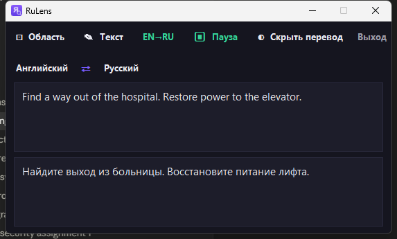

# RuLens — экранный переводчик-«линза»

Перевод текста с экрана (игры, видео, программы) **прямо поверх оригинала**, как в Thaluna Lens Mode. Бесплатно, локальный OCR (Windows OCR), перевод через Bing (резерв — Google). Перевод рисуется **в том же месте и тем же размером**, что и оригинал; цвет, толщина (жирный/обычный) и размер шрифта берутся из исходного текста (семейство — системный Segoe UI; точное название шрифта из пикселей восстановить нельзя). Кнопка **EN→RU / RU→EN** переключает направление.

## Установка (для распространения)

Готовый установщик — **`installer\out\RuLens-Setup.exe`** (~19 МБ). Это и есть файл, которым делишься. У друга:

1. Запустить `RuLens-Setup.exe`. Windows SmartScreen скорее всего покажет «Windows защитила ваш компьютер» (приложение без цифровой подписи) — нажать **«Подробнее» → «Выполнить в любом случае»**.
2. Установка идёт **без прав администратора** в личную папку пользователя, создаёт ярлыки на рабочем столе и в меню Пуск (можно отметить «Запускать при входе в Windows»).
3. Удаление — через «Установка и удаление программ» или ярлык «Удалить RuLens».

Требования у получателя:
- **Windows 10/11.**
- **Перевод текста и экрана** работает через интернет (Bing/Google) — нужен онлайн.
- Для перевода **с русского** (RU→EN) нужен русский пакет распознавания: *Параметры → Время и язык → Язык → Русский → Языковые компоненты → Распознавание текста (OCR)*. Английский OCR обычно есть сразу (перевод EN→RU работает «из коробки»).

### Пересборка

`powershell -ExecutionPolicy Bypass -File build.ps1` — пересобирает `RuLens.exe` (PyInstaller) и `RuLens-Setup.exe` (Inno Setup).

## Запуск (для разработки)

- Установленный ярлык **«RuLens — Переводчик экрана»**, или
- `RuLens.bat` / `venv\Scripts\python.exe -m rulens` (с консолью и статусами).

Настройки и лог: `%APPDATA%\RuLens\` (`config.json`, `rulens.log`).

Приложение показывается **на панели задач** (значок с «Я» и лупой) и держит **значок в трее**.

## Окно, панель задач и трей

Панель управления — обычное окно «RuLens» поверх остальных, с заголовком и значком:

- **— (Свернуть)** в заголовке → сворачивается **на панель задач** (значок остаётся на панели задач, кликом — разворачивается обратно).
- **✕ (Закрыть)** в заголовке → прячется **в трей** (окно и кнопка с панели задач исчезают, остаётся значок в трее).
- Кнопка **«Выход»** в панели → полностью закрыть программу.
- Значок в трее (правый клик) — меню: Показать панель, Перевести область, Сменить направление, Авто-перевод, Скрыть/показать перевод, Выход. Двойной клик — показать панель.
- В Windows 11 новые значки трея прячутся под стрелкой **^**. Чтобы значок RuLens всегда был виден — перетащите его из выпадающего списка на видимую часть трея (один раз, вручную).

## Управление — кнопки на панели

| Кнопка | Действие |
|---|---|
| ⊡ **Область** | выделить область с текстом мышью — **перевод сразу включается** |
| ✎ **Текст** | развернуть/свернуть встроенную панель перевода текста |
| **EN→RU / RU→EN** | переключить направление перевода (язык распознавания и язык вывода меняются местами) |
| ▶ **Авто** / ⏸ **Пауза** | включить/приостановить постоянный перевод |
| ◐ **Скрыть / Показать перевод** | спрятать или вернуть перевод поверх экрана |
| **Выход** | полностью закрыть программу |

Самый простой сценарий: **нажать «Область» → выделить → готово.** Перевод появляется и сам обновляется.

## Перевод текста (встроенная панель)

Кнопка **✎ Текст** разворачивает/сворачивает панель перевода прямо под кнопками (как часть окна). Вверху — пара языков с кнопкой **⇄**, поле ввода, ниже — результат. Переводит **на лету** при наборе/вставке. Копирование и вставка — обычными **Ctrl+C / Ctrl+V** (работают на любой раскладке, в т.ч. русской), результат можно выделить и скопировать. Кнопка ⇄ меняет направление и переносит перевод в поле ввода. Направление здесь своё, не зависит от перевода экрана.

## Горячие клавиши (то же самое, без мыши)

| Клавиши | Действие |
|---|---|
| `Ctrl+Q` | Выбрать область (перевод сразу включается) |
| `Ctrl+Alt+L` | Перевести область один раз |
| `Ctrl+Alt+A` | Авто вкл/выкл |
| `Ctrl+Alt+H` | Скрыть/показать перевод |
| `Ctrl+Alt+X` | Выход |

## Важно для игр

- Игра должна быть в **оконном режиме / borderless**, не в эксклюзивном полноэкранном — иначе оверлей не виден.
- И перевод, и панель «прозрачны» для захвата: не попадают в скриншоты и не переводят сами себя.

## Что переводится, а что нет

RuLens не переводит подряд всё, что распознал — есть умный фильтр (`text_filters.py`):

- **Пропускает «не-текст»:** числа, время (`21:46`), даты, проценты (`100%`), версии (`v2.1.0`), отдельные символы, строки без настоящих слов.
- **Пропускает текст не на исходном языке:** при EN→RU не трогает то, что уже по-русски (и наоборот) — по тому, какими буквами написано.
- **Пропускает «пустой» перевод:** если движок вернул текст без изменений (имена собственные, `OK`, `GitHub`, `Opus`) — оригинал не закрывается копией.

Важное ограничение: язык распознавания привязан к направлению. Если включено **EN→RU**, а на экране русский текст — английский OCR прочитает его как латинскую «кашу». Для контента на другом языке переключайте направление кнопкой **EN→RU / RU→EN**.

## Скорость и качество

- Перевод — **Bing** (резерв Google при сбое). Оба ~75 мс; Bing даёт более естественный русский.
- Авторежим обновляется каждые **350 мс** (`interval_ms` в `config.json`); неизменившиеся кадры пропускаются почти бесплатно, повторный текст берётся из кэша.

## Настройки

`config.json`: языки (`source_lang`/`target_lang`), горячие клавиши, интервал (`interval_ms`), позиция панели (`control_pos`), область (`region`), шрифт (`style.font_family`). OCR на этом ПК: английский (`en`), русский (`ru`). Языки перевода — любые, какие умеет движок.

## Тесты

- `venv\Scripts\python.exe -m pytest` — модульные тесты (37 шт.).
- `venv\Scripts\python.exe test_e2e.py` — сквозной тест с реальным оверлеем.
- `venv\Scripts\python.exe smoke_test.py` — быстрый конвейер OCR→перевод.

Зависимости: `pip install -r requirements.txt` (Python 3.10, Windows).
